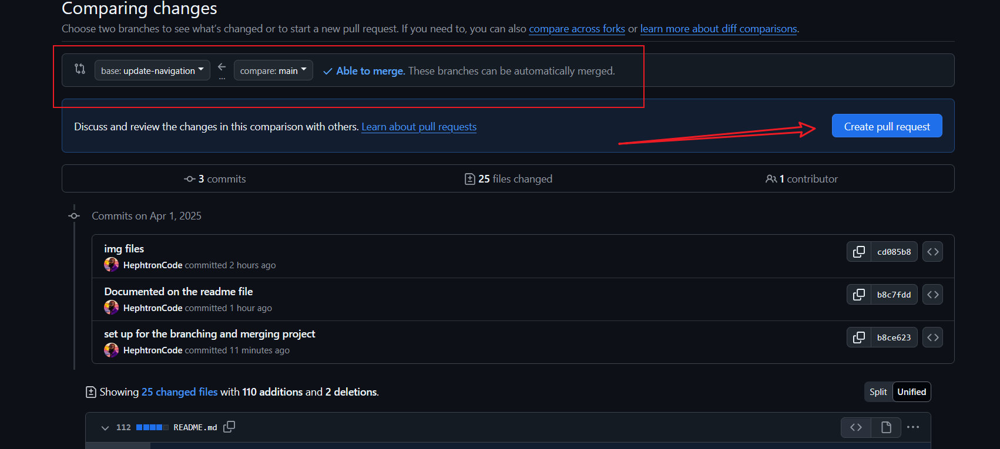
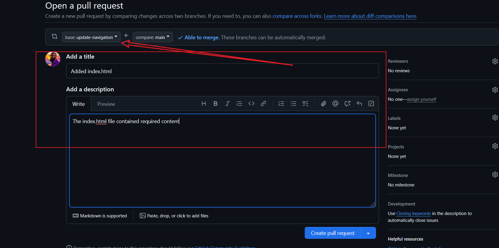
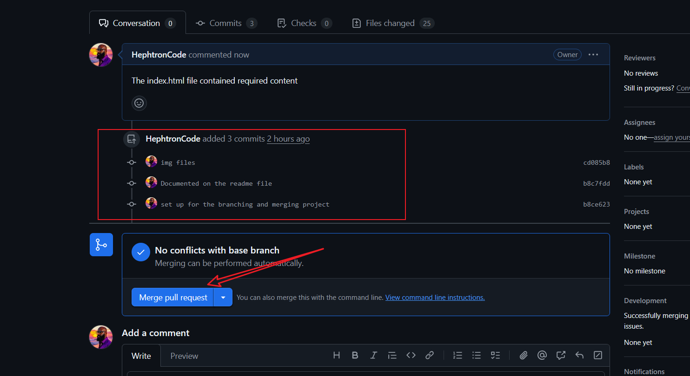
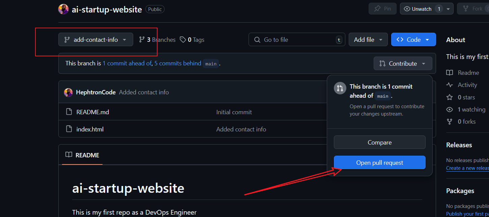
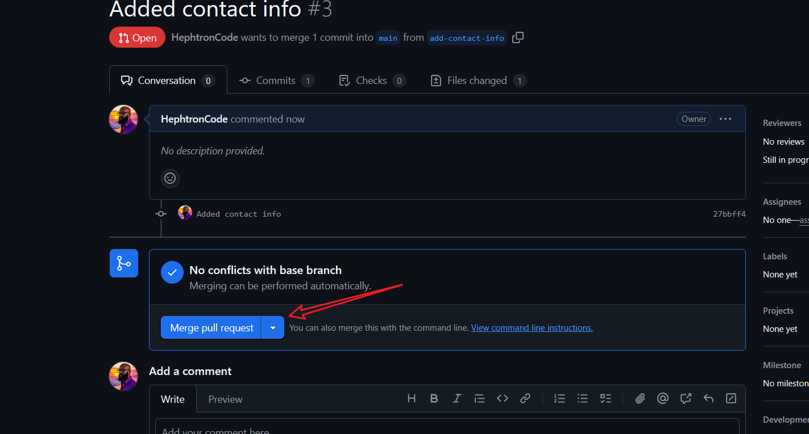
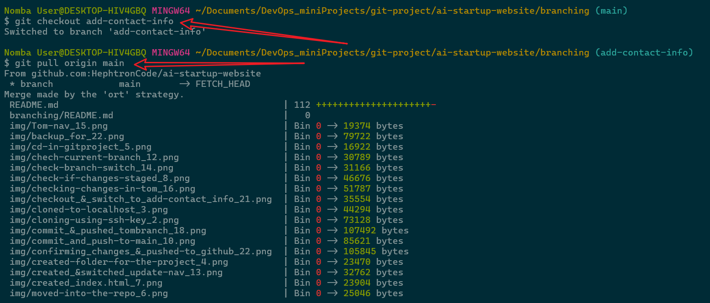
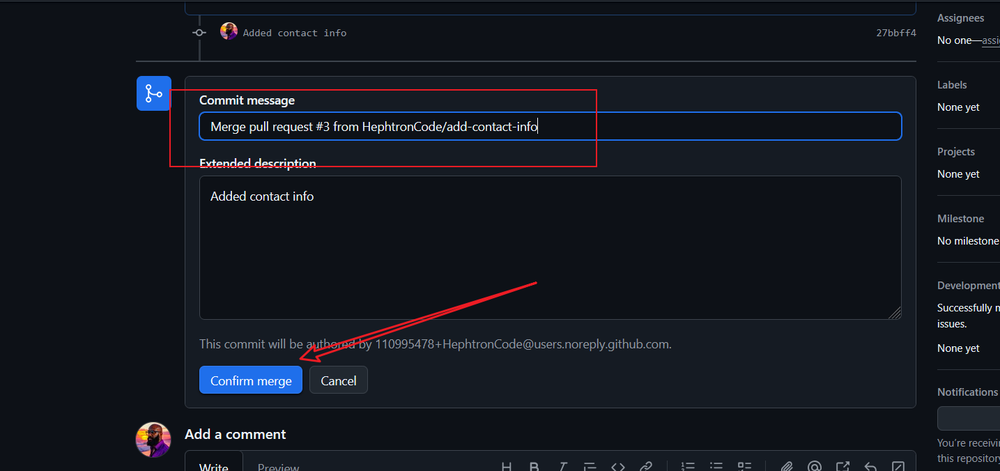

# Branching and Merging Mini Project

## Switching to branch update-navigation

## Creating a pull request for update-navigation

## Merging the update-navigation branch to main

## Creating a pull request for add-contact-info

## Switching branch with the use of the 
`git checkout <branch>`
command

## Confirming merge request

