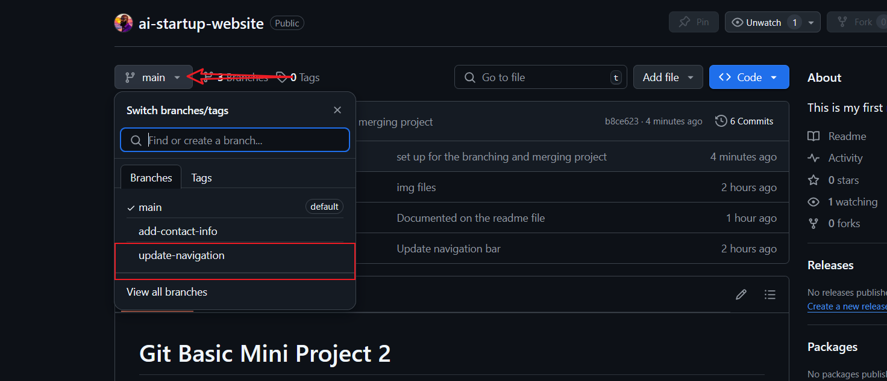

# Branching and Merging Mini Project

## HTML file

## Switching to branch update-navigation

## Creating a pull request for update-navigation

## Merging the update-navigation branch to main

## Creating a pull request for add-contact-info

## Switching branch with the use of the 
`git checkout <branch>`
command

## Confirming merge request

## Pulling the changes to main branch

## pushing the changes to remote repository

## Switching to the main branch

## Trying to merge the changes from the add-contact-info branch to the main branch with a conflict

## Checking the changes in the add-contact-info branch

## Resolving the merge conflict

## Adding the changes to the staging area

## Checking the merge history with the use of the `git log --merge` command

## Committing the changes to the main branch

## Pushing the changes to the remote repository

## Pulling the changes to the main branch

## Merging the changes to the main branch

